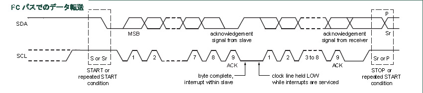

# I2C制御関数仕様書  
---
 項目         | 内容  
:-------------|:-------------
 作成者　　　　| starfort@nifty.com    
 レビジョン　　| 00.01.00 
 発行日　　　　| 2016/12/23 
 来歴　　　　　| 00.01.00 : 2016/12/23 : 新規作成  
---
## １．目的
本文書では、I2C接続されたスレーブデバイスを制御する関数を規定する。   
詳細は NXP製マイクロコントローラー LPC-11U37用プログラムのソースコードを参照のこと。

---
---
## 2．関数の概要  
---
関数は、I2Cバスを直接制御する低レベル関数群と、I2Cデバイスの機能を利用するサービス関数群から構成される。
### 1) 低レベル関数
- 本プログラムでは LPC-11U37 の I2C Controller をマスター・モードで利用する。  
- I2Cバスの動作速度は clk\_config 決定され、デフォルトは Fast-mode(400 kbps)となっている。  
(SCLH + SCLL を設定することで変更可能、I2Cbitfrequency = I2CPCLK / SCLH + SCLL)
- 低レベル関数は転送パラメータを設定する関数と時間軸に沿って処理する関数に大別される。  
1) 転送するパラメータを設定する関数  
　i2c_write、i2c_write16、i2c_read  
I2Cバスのデータ転送方向はセットされるスレーブアドレス7bitに続く1bitで決定される。  
これらの関数はスレーブ・アドレスを 1 bit 左シフトし、転送方向を示す最下位bitを付加した 8 bit を最初の転送データとして内部レジスタにセットする。  
また、続くデータ列を 8 bit 毎に処理するため内部レジスタに値を設定する。
2) 時間軸に沿って処理する関数  
　I2CInit、I2CStart、I2CEngine、I2CStop  
I2Cバスのリセット、マスターとスレーブの確定、データ転送、トランザクションの終了を行う。  
下図にI2Cバスの仕様書記載のタイムチャートと各関数の関係を示す。  
  
　　<-I2CInit-> <-I2CStart-> <-　　　　　　　　　　I2CEngine　　　　　　　　　　-> <-I2Stop->

### 2) サービス関数
- I2Cスレーブ・デバイス LCD Controller ST7230i を扱うための関数である。  
- デバイスの内部レジスタに直接 R/W する低レベル関数群と LCD 表示用の関数群で構成される。  
1) 低レベル関数  
　i2c_lcd_backlight、i2c_lcd_set_cmd、i2c_lcd_set_data    
バックライトON/OFF、レジスタ・アドレス設定、レジスタ・データ設定を行う。
2) LCD 表示用の関数  
　i2c_lcd_init、i2c_lcd_clear、i2c_lcd_put_icon、i2c_lcd_put_string、i2c_lcd_put_hex8、i2c_lcd_put_decimal  
LCD の初期化、画面クリア、アイコン表示、文字表示、数字表示を行う。

---
---
## 3．関数・リファレンス
---
### 1) i2c_write
- 宣言　：　unsigned char i2c_write(unsigned char addr, unsigned char eeaddr, unsigned char dat)  
- 引数　：　addr - スレーブ・アドレス（ 7-bit : 0x00 ～ 0x7f )  
　　　　　  eeaddr - デバイス内部アドレス（ 8-bit )  
　　　　　dat - デバイスへ書き込むデータ（ 8-bit )
- 戻り値： result - ステータス・コード
- 説明　：　I2Cのスレーブ・デバイスへデータを 1 Byte 書き込む。
- ノート：　スレーブ・アドレスの表記は16進数（小文字を使用）です。  
　　　　　値の範囲は 7bit で LSB 詰めです。(0x00 ～ 0x7f)  
　　　　　10bit拡張アドレスには対応しておりません。  
- 例　　：

          >i2c_write 0x1e 0x5a 0xc3  
          >0  
          >
　　　
### 2) i2c_write16
- 宣言　：　unsigned char i2c_write16(unsigned char addr, unsigned char eeaddr, unsigned short dat)  
- 引数　：　addr - スレーブ・アドレス（ 7-bit : 0x00 ～ 0x7f )  
　　　　　  eeaddr - デバイス内部アドレス（ 8-bit )  
　　　　　dat - デバイスへ書き込むデータ（ 16-bit )
- 戻り値： result - ステータス・コード
- 説明　：　I2Cのスレーブ・デバイスへデータを 2 Byte 書き込む。
- ノート：　スレーブ・アドレスの表記は16進数（小文字を使用）です。  
　　　　　値の範囲は 7bit で LSB 詰めです。(0x00 ～ 0x7f)  
　　　　　10bit拡張アドレスには対応しておりません。  
- 例　　：

          >i2c_write16 0x1e 0x5a 0xc3b7  
          >0  
          >
　　　
### 3) i2c_read
- 宣言　：　unsigned char i2c_read(unsigned char addr, unsigned char eeaddr, unsigned char *buff, unsigned char len)  
- 引数　：　addr - スレーブ・アドレス（ 7-bit : 0x00 ～ 0x7f )  
　　　　　  eeaddr - デバイス内部アドレス（ 8-bit )  
　　　　　buff - デバイスから読み込んだデータをセットするバッファへのポインタ  
　　　　　len - デバイスから読み込むデータ・サイズ（ 8-bit )  
- 戻り値： result - ステータス・コード
- 説明　：　I2Cのスレーブ・デバイスからデータを読み込む。
- ノート：　スレーブ・アドレスの表記は16進数（小文字を使用）です。  
　　　　　値の範囲は 7bit で LSB 詰めです。(0x00 ～ 0x7f)  
　　　　　10bit拡張アドレスには対応しておりません。  
- 例　　：

          >i2c_read 0x1e 0x80 &buf[0] 0x40  
          >0  
          >
　　　
---